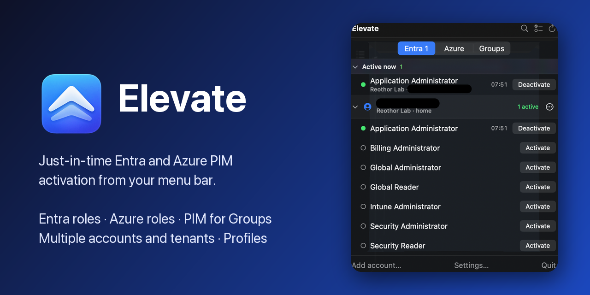

<h1> Elevate</h1>

[](https://github.com/FrodeHus/elevate/actions/workflows/macos.yml) [](https://github.com/FrodeHus/elevate/releases/latest) [](LICENSE) [](#install-macos)

Just-in-time Microsoft Entra and Azure PIM role activation from your menu bar or system tray, across accounts and tenants.



Elevate lists every account you have signed in with, each tenant that account can reach, and everything you are eligible for in it: Entra directory roles, Azure resource roles and PIM for Groups memberships. Activate with the policy's default duration and a reason Elevate remembers, select several across tenants and activate them together, or save a selection as a profile and run it with one click. Active roles show a live countdown, can be extended or deactivated, and raise notifications before and at expiry. Sign in with your own app registration, a company app registration, or the Azure CLI / Azure PowerShell app for Azure resource roles.

| App | Status | Docs |
|---|---|---|
| [macOS](macos/) — SwiftUI menu bar app, macOS 26 | Usable: Entra roles, Azure roles, PIM for Groups, profiles, sign-in methods | [macos/README.md](macos/README.md) |

## Install (macOS)

**Requirements:** macOS 26 (Tahoe), and an Entra app registration — either your own or a company one
— to sign in with; the Microsoft Azure CLI or Azure PowerShell app needs no registration but covers
Azure resource roles only.

Homebrew (the cask lives in this repository, which doubles as a tap):

```bash
brew tap FrodeHus/elevate https://github.com/FrodeHus/elevate
brew trust frodehus/elevate        # Homebrew 6 requires trusting third-party taps
brew install --cask frodehus/elevate/elevate
xattr -d com.apple.quarantine /Applications/Elevate.app   # unsigned builds only
```

Plain `brew install --cask elevate` does not resolve: this tap is not a `homebrew-`
named repository, so the fully qualified `frodehus/elevate/elevate` name is required.

Or download the DMG from the [latest release](https://github.com/FrodeHus/elevate/releases/latest) —
the asset is named `Elevate-<version>.dmg`, with `Elevate-<version>.dmg.sha256` next to it — open it
and drag **Elevate** to Applications.

**Upgrade:**

```bash
brew upgrade --cask frodehus/elevate/elevate
xattr -d com.apple.quarantine /Applications/Elevate.app   # rerun while builds are unsigned
```

The upgrade replaces the app bundle, so the quarantine flag comes back and the `xattr` command has
to be rerun until builds are signed and notarized. Elevate also checks the GitHub releases API for a
newer version once a day and shows a notice in the panel when one is available.

### Opening an unsigned build

Releases today are ad-hoc signed, not signed with an Apple Developer ID and not notarized, so macOS
refuses to open them on a double-click. Either remove the quarantine flag as shown above with
`xattr -d com.apple.quarantine /Applications/Elevate.app`, or after copying the app to Applications:

1. Open **Elevate.app** once.
2. When macOS blocks it, open **System Settings → Privacy & Security**, scroll to the message
   about Elevate and click **Open Anyway**.
3. Confirm **Open Anyway** again when prompted. macOS remembers the choice; later launches are normal.

If macOS still refuses, remove the quarantine flag directly:

```bash
xattr -d com.apple.quarantine /Applications/Elevate.app
```

Signed and notarized builds — no prompts, no `xattr` step — will ship as soon as an Apple
Developer ID is available; the release workflow already switches over automatically once the
signing secrets exist. See [docs/releasing.md](docs/releasing.md).

## Repository layout

```
macos/     Swift package (ElevateCore) + XcodeGen app target (ElevateApp) + tests
windows/   .NET solution (Elevate.Core, Elevate.App, tests, WiX installer, winget manifest)
shared/    Assets used by both apps: the Entra built-in roles catalogue script
docs/      Design specs and implementation plans (docs/superpowers/specs, docs/superpowers/plans)
```

## Getting started

1. **Create the Entra app registration** that Elevate signs in with. The step-by-step guide covers
   both the Azure CLI route (a script and a permissions manifest are included) and the portal:
   [docs/entra-app-registration.md](docs/entra-app-registration.md).
   - Script: [docs/entra-app/create-app-registration.sh](docs/entra-app/create-app-registration.sh)
   - Permissions manifest for `az ad app create`: [docs/entra-app/required-resource-access.json](docs/entra-app/required-resource-access.json)
2. **Build and run the macOS app**: [macos/README.md](macos/README.md) — prerequisites, build
   steps, sign-in methods, and what each account type can and cannot activate.
3. **Consent per tenant**: an admin grants the delegated permissions once per tenant, either with
   `az ad app permission admin-consent` or through the consent link Elevate offers from each
   tenant's menu. Details in the guide's "Consent" section.

Accounts that cannot use your registration can be added with the Azure CLI or Azure PowerShell
app (Azure resource roles only) or with another company app registration through the loopback
flow; see [Sign-in methods](macos/README.md#sign-in-methods).

## Security

- **Tokens stay in the macOS keychain.** The loopback browser flow stores its refresh token in your
  login keychain (this device only); signed builds sign in with MSAL, which keeps its own cache in
  the keychain. Nothing is written to disk in plain text.
- **Where Elevate connects.** Microsoft identity platform (login), Microsoft Graph and the Azure
  Resource Manager endpoints, plus the GitHub releases API for the once-a-day update check. Nothing
  else.
- **No telemetry.** No analytics, no crash reporting, no phone-home of any kind.
- **Diagnostics are safe to paste.** The report behind Settings → Copy diagnostics has no field for
  a token or a client id, so neither can appear in it.
- **Reporting a vulnerability:** see [SECURITY.md](SECURITY.md).

## Documentation

| Topic | Where |
|---|---|
| Documentation index | [docs/README.md](docs/README.md) |
| App registration, permissions, consent, troubleshooting sign-in errors | [docs/entra-app-registration.md](docs/entra-app-registration.md) |
| macOS app: build, sign-in methods, panel, profiles, manual roles, smoke test | [macos/README.md](macos/README.md) |
| Cutting a release: tagging, the workflow, signing secrets, the cask | [docs/releasing.md](docs/releasing.md) |
| Windows app plan | [windows/README.md](windows/README.md) |
| Design specs | [docs/superpowers/specs/](docs/superpowers/specs/) |
| Implementation plans | [docs/superpowers/plans/](docs/superpowers/plans/) |

## Contributing and support

Contributions are welcome — start with [CONTRIBUTING.md](CONTRIBUTING.md) for the prerequisites,
build and test commands, and the conventions this repository keeps. Bugs and feature requests go to
the [issue tracker](https://github.com/FrodeHus/elevate/issues); what changed in each release is in
[CHANGELOG.md](CHANGELOG.md).

## Roadmap

- **Windows 11 tray app (WinUI 3, .NET 10): designed, not yet implemented** — see
  [windows/README.md](windows/README.md).

## License

MIT, see [LICENSE](LICENSE).
