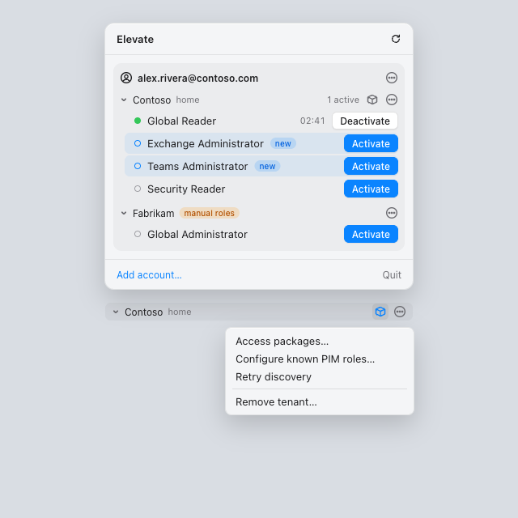
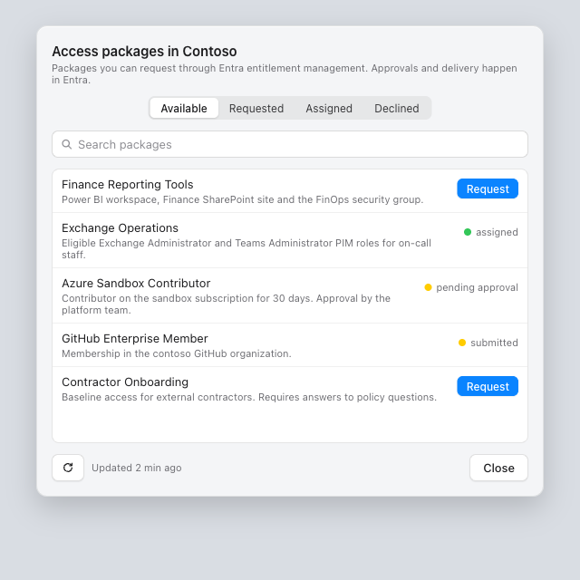
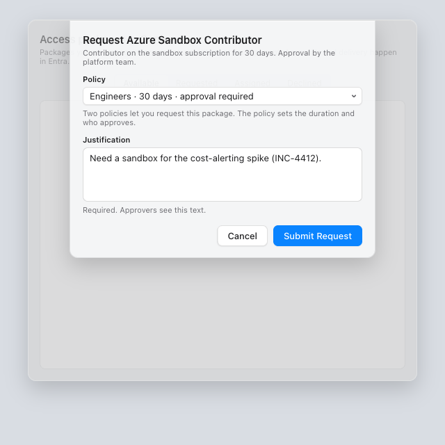
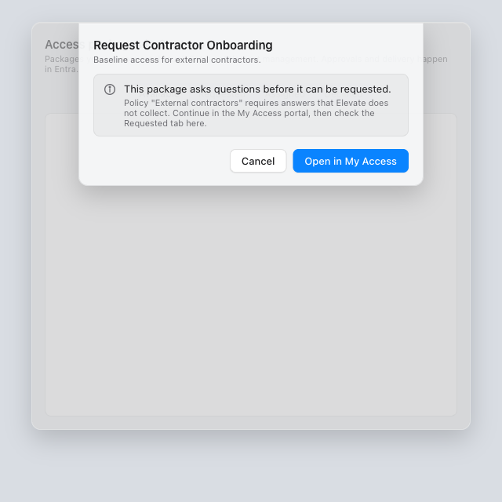
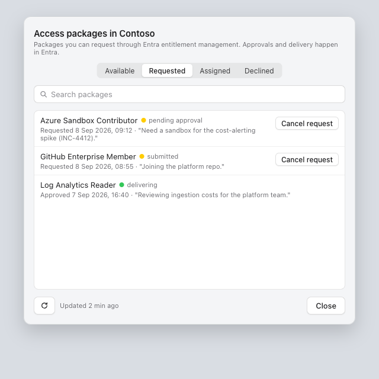
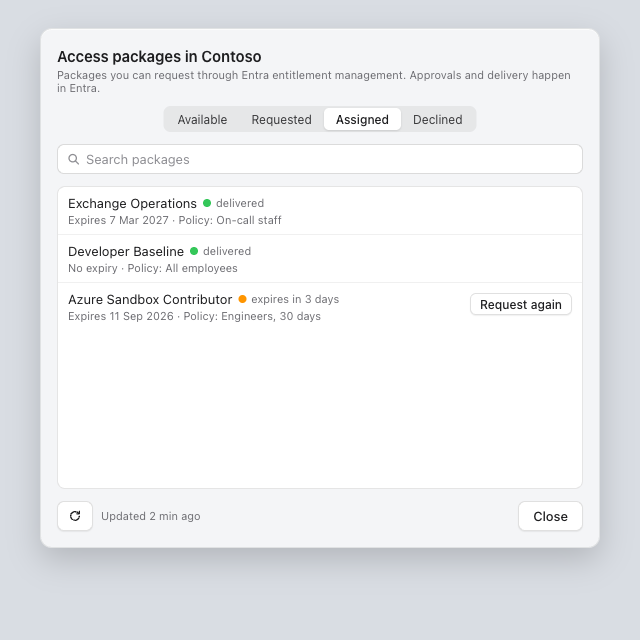
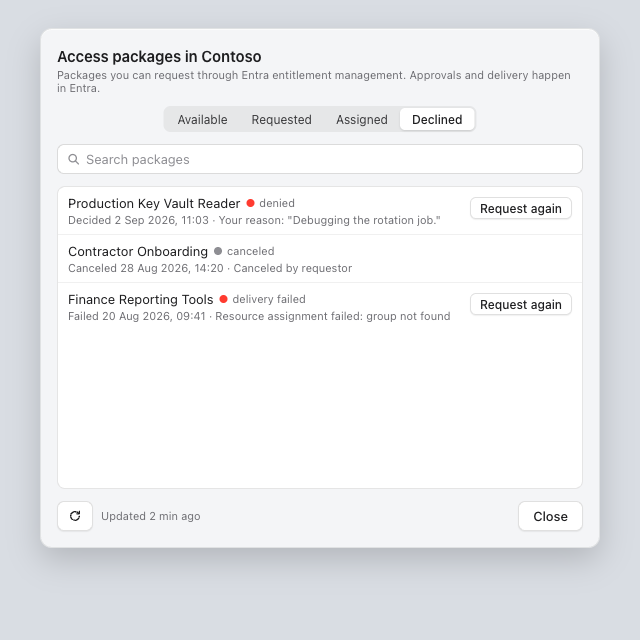

# Requesting access packages with Elevate

Access packages are bundles of access that your organization offers through
Microsoft Entra entitlement management: group memberships, application roles,
SharePoint sites, Azure roles, or eligible PIM roles. Elevate lets you find the
packages you are allowed to request, request them, and keep an eye on what
happened, all from the menu bar.

> The pictures in this guide are design mockups with sample data from a
> fictional organization; the real app looks the same in layout and wording.

## Before you start

Access packages need one extra permission that Elevate asks for when you sign
in with the Elevate app registration. Nobody has to approve it for you; you
accept it yourself the next time Elevate asks you to sign in.

Accounts added with the **Azure CLI** or **Azure PowerShell** sign-in methods
cannot use this feature. Those Microsoft apps are never granted the permission,
so for such accounts the access package controls simply do not appear.

## Finding the access packages for a tenant

Open the Elevate panel from the menu bar. Every tenant that supports access
packages shows a small box icon next to its name, and an **Access packages…**
item at the top of its tenant menu.

Click either one to open the access packages window for that tenant. Each
tenant has its own window, so if you have several tenants you pick the one you
want first.

If a tenant shows neither the icon nor the menu item, see
[When the controls do not appear](#when-the-controls-do-not-appear).

## The access packages window

The window has four tabs and a search field. Search filters the tab you are on
by package name and description, so with hundreds of packages you can type a
word or two instead of scrolling.

- **Available** lists every package you are allowed to request. Packages you
  already hold, or have a request open for, show their state instead of a
  Request button.
- **Requested** shows requests that are still in progress.
- **Assigned** shows the packages you currently have.
- **Declined** shows requests that were denied, failed, or that you canceled.

If your search does not match anything on the current tab, the list shows a
caption such as "No matches for “finance”." instead of the tab's usual
empty message.

At the bottom, the refresh button fetches the latest state from Entra, and the
caption next to it tells you when the window was last updated. Press **Close**
or Escape to dismiss the window.

## Requesting a package

1. On the **Available** tab, find the package and click **Request**.
2. If more than one policy lets you request the package, choose one from the
   **Policy** menu. The policy decides how long the access lasts and who has
   to approve it. When only one policy applies, the menu is not shown.
3. Type a **Justification**. This is required, and the people who approve
   your request will read it, so say what you need the access for.
4. Click **Submit Request**.

Elevate switches to the **Requested** tab so you can see your new request. If
the policy does not need approval, the package is usually delivered within a
minute or two.

### Packages that ask questions

Some packages require you to answer questions before you can request them, for
example a cost center or a manager's name. Elevate does not collect those
answers. When you click Request on such a package, the sheet explains this and
offers **Open in My Access**, which takes you to Microsoft's My Access portal
with the package already selected. Finish the request there, then come back to
Elevate and check the **Requested** tab.

## Following your requests

The **Requested** tab lists your open requests, newest first, with the date you
submitted them and the justification you wrote.

The coloured dot tells you the state at a glance:

| Dot | State | Meaning |
|---|---|---|
| Yellow | submitted, pending approval | Waiting for Entra, or for an approver |
| Green | delivering | Approved; Entra is granting the access now |
| Orange | expires soon | The assignment ends within a week |
| Red | denied, delivery failed | Not granted, or granting it failed |
| Grey | canceled | You withdrew the request |

To withdraw a request that has not been decided yet, click **Cancel request**
next to it. It moves to the **Declined** tab as canceled.

## Seeing what you have

The **Assigned** tab shows every package you currently hold, when it expires,
and which policy granted it. Packages without an end date say **No expiry**.

When an assignment is about to expire, its row turns orange and offers
**Request again**, which starts a new request for the same package.

## Denied, failed, and canceled requests

The **Declined** tab keeps requests that did not result in access. Denied and
failed requests offer **Request again**. For failed and canceled requests the
row also shows the reason Entra recorded.

Elevate shows your own justification here. It cannot show the approver's
comment, because reading approval details needs an administrator permission
that ordinary users do not have. If you need the approver's reasoning, look up
the request in the My Access portal.

## Notifications

You do not need to keep the window open. Elevate checks your requests and
assignments in the background a few times a day, and every time you open the
panel, and sends a macOS notification when:

- a request is **approved** or **denied**, or its delivery **failed**;
- an assignment is **revoked** by an administrator;
- an assignment **expires**. Expiry notifications are timed to the end date,
  so they arrive on time even between background checks;
- **new eligible roles** appear in a tenant, whether they came from an
  approved access package, a group change, or an administrator.

The first time Elevate sees a tenant it only records what is there, so adding
an account or a tenant never produces a burst of notifications.

## New roles in the panel

When new eligible roles appear, the panel marks them with a tinted row and a
**new** badge so you can spot them without reading the whole list. The marker
is meant to catch your eye once: it disappears the second time you open the
panel after the roles were first shown.

You can see this in the [first picture](#finding-the-access-packages-for-a-tenant)
above, where Exchange Administrator and Teams Administrator are marked new.

## When the controls do not appear

If a tenant shows no box icon and no **Access packages…** menu item:

- **The account uses Azure CLI or Azure PowerShell sign-in.** Those methods
  never get the permission. Add the account again with the Elevate app
  registration method to use access packages.
- **Elevate has not been granted the permission yet.** Choose **Sign in
  again** for the account. When the sign-in asks for the new permission,
  accept it.
- **Your organization blocks users from consenting to permissions.** In that
  case an administrator has to grant it once for everyone. Send them the
  admin consent link from the tenant menu.
- **Elevate has not refreshed since you signed in.** Open the panel once more,
  or click the refresh button in the panel header.

If the window opens but shows "Access packages are not permitted in this
tenant", the permission was refused or has been withdrawn. The same admin
consent link fixes it.
