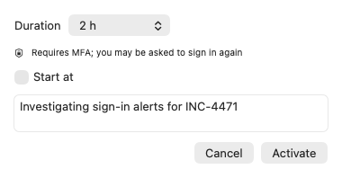
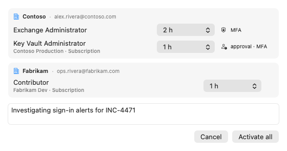
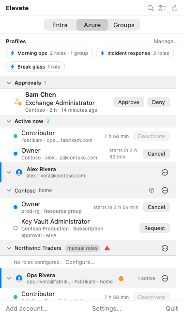
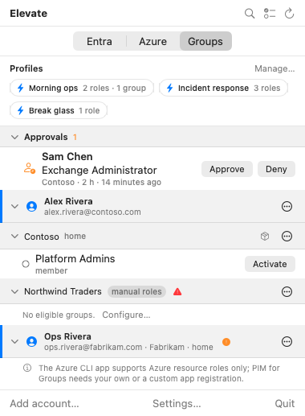

# Activating roles with Elevate

This guide covers the everyday work: turning an eligible role on, keeping an eye on it, and
turning it off. It assumes you have added an account; see
[Getting started](getting-started.md) if not.

> The pictures in this guide are real renders of the app with sample data from a fictional
> organization.

## Reading a role row

Every eligible role is one row under its tenant. The dot at the left tells you its state:

| Dot | Meaning |
|---|---|
| Hollow | Eligible, not active |
| Hollow green | Active, but the access is not usable yet; see [Ready, not just active](#ready-not-just-active) |
| Green | Active and in effect; the countdown on the right shows time left |
| Orange | Awaiting approval or being provisioned |
| Blue | Scheduled to start later |
| Red | The last request failed; hover the message for details |

Small captions under a role name explain what activating it involves: **MFA** means Microsoft
will ask you to verify again, **approval** means someone has to approve first, and **via
<group>** means you hold the eligibility through a group. Azure roles show the scope under the
name, such as a resource group or subscription; hover it for the full path.

## Activate one role

Click **Activate** on the row (it reads **Request** when the role needs approval). A small sheet
opens:

1. **Duration** defaults to what the policy allows, in 30-minute steps up to the policy maximum.
2. **Reason** is remembered per role, so the next activation is pre-filled. Change it when the
   reason changed.
3. Turn on **Start at** to schedule the activation for later; the role shows as scheduled with
   "starts in" on its row until then, and can be canceled from the row.
4. Click **Activate**. If MFA or Conditional Access applies, your browser opens for a step-up
   sign-in and Elevate continues when you return.

The row turns green with a countdown. Roles that need approval show **awaiting approval** with a
**Cancel** button to withdraw the request; Elevate polls every minute and flips the row to active
once it is approved.

### Ready, not just active

PIM records an activation well before the access behind it works — two to five minutes for an Entra
directory role, up to fifteen for an Azure resource role. Until Elevate has checked that the role
is genuinely in effect, the row shows a **hollow** green dot and reads **propagating (~3 min)**
beside its countdown. The countdown runs from the moment PIM recorded the activation, so it is
already ticking.

The activation sheet holds for the first check before it closes, so in the common case — a role
that is already in effect — the last thing it says is **Ready** rather than a word that only means
PIM wrote the assignment down. If the check has not answered within a few seconds the sheet closes
anyway and the row carries the rest; it never holds you there for minutes.

When the check succeeds the dot fills and Elevate notifies you, so you can switch away and be told
when to come back. If it never succeeds the row reads **not in effect yet** — and Elevate says so
in a notification too, because by then you have almost certainly moved on. Hover the row for the
usual reason, which is almost always a tool still holding a token minted before the activation. The
role is active either way, and can be deactivated at any point.

Some roles cannot be checked from here — one scoped to an administrative unit, and group
*ownership* — and those rows simply go green as before.

### The quick way

Hold **Option** and click **Activate** to skip the sheet. Elevate reuses the last reason and
duration for that role and posts a notification with the outcome. The sheet opens as usual when
the role requires approval or a ticket number, or when there is no remembered reason yet.

## Activate several at once

Click the **select roles** button in the header (the list-with-ticks icon), tick roles in any
tenant, on any tab, then click **Activate N roles**:

The sheet groups the roles by account and tenant, with a duration per role and one reason for
all of them. Progress shows next to each row as Elevate works through them, one tenant at a time.

If you activate the same set regularly, save it as a profile instead. See
[Profiles and shortcuts](profiles-and-shortcuts.md).

## Extend, deactivate, cancel

- **Deactivate** ends an active role now. Entra enforces a five-minute minimum, so the button
  waits, with a tooltip counting down, when a role was activated less than five minutes ago.
- **Extend** appears during the last fifteen minutes of an activation. It activates the role
  again for a fresh duration; Option-click to reuse the last reason without the sheet. Roles
  that need approval do not offer it, since the re-activation would only be pending.
- **Cancel** withdraws a request that is awaiting approval, or a scheduled activation that has not
  started.

The **Active now** section at the top collects every active, pending and scheduled role across
all accounts, with the same controls.

## Azure roles and groups

The **Azure** tab lists eligibilities on management groups, subscriptions, resource groups and
individual resources. The first Azure activation in a tenant asks you to consent to Azure
Service Management; no administrator is needed.

Rather than listing them flat, the tab groups them by scope: each header opens and closes with its
chevron and says how many roles sit under it. A scope that only passes through — no eligibility of
its own and one way down — is folded into the node below it and named there ("Alpha / prod"), so
the panel does not spend a row and a level of indent on nothing; a scope leading to a single role
gets no header at all, and the role row stands where the header would have. In select mode a scope
header carries its own checkbox: one press takes every eligibility under it, which is what
"Contributor across these twelve subscriptions" costs now. A half-filled checkbox means part of the
subtree is already ticked, and pressing it takes the rest.

Management groups sit beside the subscriptions rather than above them: ARM writes a management
group scope as its own flat path and never repeats it in a subscription's, so the eligibilities
alone cannot say which subscriptions belong to which management group.

The **Groups** tab lists PIM for Groups memberships and ownerships. Activating one makes you a
member or owner of the group for the duration, which in turn may grant Entra or Azure roles.
Elevate re-reads your roles shortly after a group activation so those show up too.

## Searching

Click the magnifier in the header and type. The panel keeps only the roles, tenants and accounts
that match, across all tabs. Press Escape or clear the field to see everything again; the filter
never survives closing the panel.

On the Azure tab the search narrows the tree itself rather than sitting beside it, and it reaches
the whole ARM path — so a subscription id finds its roles even when no caption on the row shows it.
Matches stay in place, including under a header you had closed.

## Notifications and the menu bar

Elevate sends macOS notifications:

- **"<Role> expires in 5 minutes"** with an **Extend** button.
- **"<Role> expired"** with an **Activate again** button.
- The outcome of a quick activation or a profile run.
- **"Approval requested"** when someone needs your decision.
- **"New roles available in <tenant>"** when your eligibilities grow; the new rows carry a
  **new** badge until the second time you open the panel.

The menu bar icon shows the number of active roles, an exclamation badge when one expires within
a few minutes, a clock while one awaits approval, and a person-with-clock when an approval waits
for you. If notifications do not arrive, allow them for Elevate under System Settings →
Notifications.
