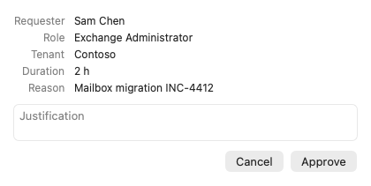

# Approving requests

If you are an approver for a role, a group or an Azure resource, other people's activation
requests reach you in Elevate. This guide shows where they appear and how to decide them.

> The pictures in this guide are real renders of the app with sample data from a fictional
> organization.

## Where requests appear

Requests waiting for your decision are pinned at the top of the panel in an **Approvals**
section, with a count in the header. Each row names the requester, the role or group, the
tenant, the requested duration and how long ago it was made. Hover a row to read the
requester's reason.

Elevate reads pending approvals every time it refreshes: when you open the panel, and every
minute while anything is active. A request you have not seen before also produces an
**"Approval requested"** notification, and the menu bar icon shows a person-with-clock badge
while any request is waiting.

## Approve or deny

Click **Approve** or **Deny** on the row. A sheet summarizes the request and asks for a
justification:

- **Approve** may be submitted without a justification. **Deny** requires one, so the requester
  understands why.
- Elevate remembers the last justification you typed and pre-fills it next time.
- Click the decision button. The row disappears at once; if the request has a further approval
  stage, it reappears on the next refresh.

If the decision fails, the reason shows in red on the row and in the sheet. A common cause is
that the request was already decided elsewhere, or that your approver assignment ended.

## Requests you cannot decide here

Elevate can decide activation requests. Requests to **extend** or **renew** an assignment are
listed for awareness but must be decided in the Entra or Azure portal; their row says
**Decide in the portal**.

Accounts added with the Azure CLI or Azure PowerShell app see Azure resource approvals only,
because Microsoft's apps have no Graph permissions for Entra roles or groups.

## Your own requests

When a role you activate needs approval, its row shows **awaiting approval** with a **Cancel**
button. Elevate keeps polling every minute and switches the row to active with a countdown once
an approver says yes. If you want to know how your access package requests are doing instead,
see [Requesting access packages](access-packages.md).
