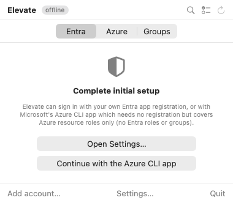
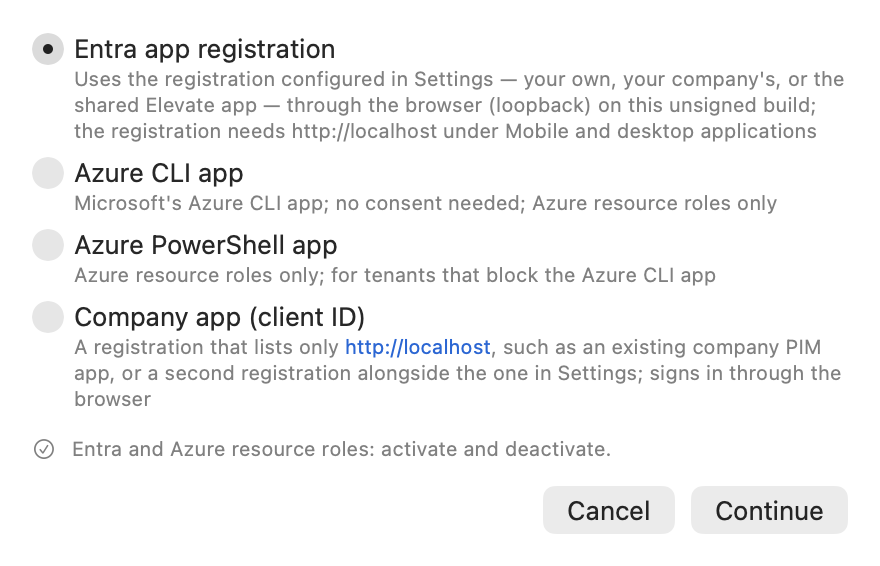
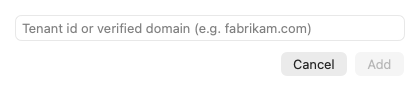
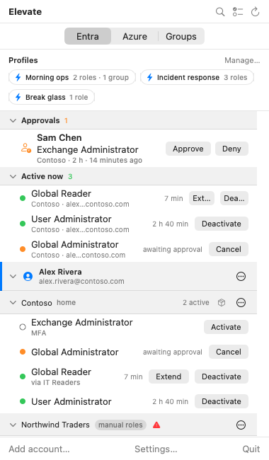
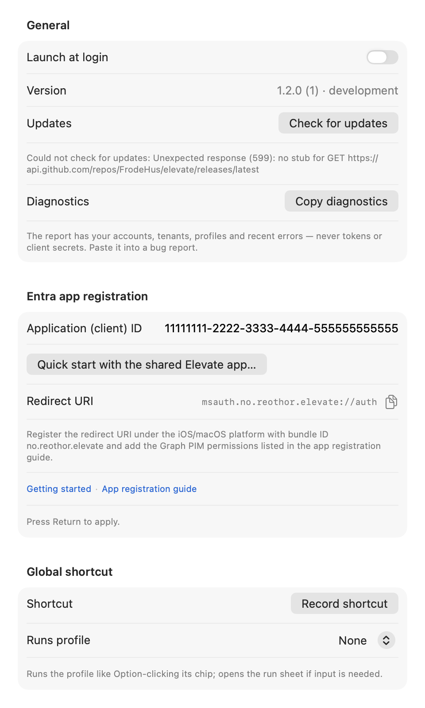

# Getting started with Elevate

Elevate lives in the macOS menu bar and lets you activate the Microsoft Entra roles, Azure
resource roles and PIM for Groups memberships you are eligible for, across every account and
tenant you use. This guide takes you from a fresh install to a panel full of roles.

> The pictures in this guide are real renders of the app with sample data from a fictional
> organization.

Other guides: [Activating roles](activating-roles.md), [Profiles and shortcuts](profiles-and-shortcuts.md),
[Approving requests](approvals.md), [Requesting access packages](access-packages.md),
[Troubleshooting](troubleshooting.md), [The shared Elevate app](shared-app-registration.md).

## 1. Install

Install with Homebrew or download the DMG; both are described in
[macos/README.md](../macos/README.md#install). Elevate needs macOS 26. After the first launch, its
icon (a double chevron) sits in the menu bar. Click it to open the panel.

## 2. Choose how to sign in

Elevate signs in with an Entra app registration. On first launch the panel asks you to complete
setup, and links to this guide and to the app registration guide on GitHub. The setup panel now
offers three buttons: **Open Settings…**, **Quick start with the shared Elevate app…** and
**Continue with the Azure CLI app**.

You have three routes:

- **The shared Elevate app (quickest).** The Elevate project publishes a multi-tenant
  registration you can use without creating one. Click **Quick start with the shared Elevate
  app…**, confirm, then have an administrator use **Grant admin consent…** once per tenant. It
  covers everything, but it is **optional and has no SLA**: it may change or be withdrawn, and
  anyone who needs control over the registration should register their own. Read
  [shared-app-registration.md](shared-app-registration.md) before you consent.
- **Your organization's Elevate registration (recommended for real use).** Someone in your
  organization creates one app registration once, following
  [entra-app-registration.md](entra-app-registration.md), and gives you its application
  (client) ID. Click **Open Settings…**, paste the ID into the **Entra app registration** field and
  press Return. This route supports everything: Entra roles, Azure roles, groups and access
  packages.
- **The Azure CLI app.** Needs no registration and no consent, but covers Azure resource roles
  only. Click **Continue with the Azure CLI app** if that is all you need, or if you cannot get a
  registration yet. You can always add a registration later.

## 3. Add an account

Click **Add account…** at the bottom of the panel. Pick the sign-in method for this account:

- **Entra app registration** uses the client ID from Settings — your own, your company's, or the
  shared Elevate app. Each tenant needs an administrator to consent once; the panel offers a
  consent link when that has not happened yet. The caption
  under the option describes how this build signs in: through Microsoft's sign-in window on a
  signed build, through your browser on an unsigned one.
- **Azure CLI app** and **Azure PowerShell app** are Microsoft's own apps. No consent, Azure
  resource roles only. Use the PowerShell one when your tenant blocks the Azure CLI.
- **Company app (client ID)** is for two cases: an existing public-client registration that
  lists only `http://localhost`, such as a company-wide PIM app, or a second registration you
  want to use alongside the one in Settings. Type its ID; Elevate reads what it was granted after
  sign-in.

Click **Continue**. Your browser opens for Microsoft sign-in and returns you to Elevate. The
account appears in the panel with its home tenant and, after a moment, the roles you are
eligible for. The same account cannot be added twice with different methods; sign it out first.

## 4. Reach other tenants

An account often has access to more than its home tenant, as a guest or through a
partner setup. Open the account menu (the circled dots on the account row) and choose:

- **Discover tenants…** lists every tenant Microsoft says the account can reach; tick the ones
  you want and click **Track selected**.
- **Add tenant…** takes a tenant ID or domain name directly.

Each tracked tenant gets its own header under the account, with a **home** tag on the account's
own tenant.

## 5. Find your way around the panel

From the top:

- **Header buttons**: search (filters roles, tenants and accounts as you type), select roles
  (for activating several at once), and refresh.
- **Entra, Azure, Groups** tabs switch between directory roles, Azure resource roles and PIM for
  Groups. Elevate remembers the tab you left it on.
- **Profiles** are saved selections you run with one click. See
  [Profiles and shortcuts](profiles-and-shortcuts.md).
- **Approvals** appears only when someone is waiting for your decision. See
  [Approving requests](approvals.md).
- **Active now** lists everything currently active or pending across all accounts, with a
  countdown.
- **Accounts and tenants** follow, each with its eligible roles. Every account and tenant row has
  a menu with actions such as sign in again, discover tenants, configure known roles, and remove.
- **Add account…**, **Settings…** and **Quit** are at the bottom.

Click a tenant name to collapse or expand it. The pills next to a tenant name tell you about
limits, for example **manual roles** or **Azure roles only**; hover for the reason.

## 6. Settings worth knowing

Open **Settings…** from the panel.

- **Launch at login** keeps Elevate in the menu bar after a restart. macOS may ask you to approve
  it under System Settings, and Elevate says so under the toggle.
- **Check for updates** looks for a newer release. Elevate also checks once a day on its own and
  shows a banner in the panel when one is available.
- **Copy diagnostics** puts a plain-text report on the clipboard for bug reports: accounts,
  tenants, profiles and recent errors, never tokens or secrets.
- **Entra app registration** is where the client ID lives. Changing it signs out the accounts
  that use it, so Elevate asks before applying. It also has **Quick start with the shared Elevate
  app…**, and shows **Shared Elevate app — no SLA** with a **Grant admin consent…** button while
  the shared id is in effect; see [shared-app-registration.md](shared-app-registration.md).
- **Global shortcut** runs a profile from anywhere; see
  [Profiles and shortcuts](profiles-and-shortcuts.md).

## What the menu bar icon tells you

The icon shows a number when roles are active. An exclamation badge means one of them expires
within a few minutes, a clock means one is awaiting approval, and a person-with-clock means
someone is waiting for your approval.
