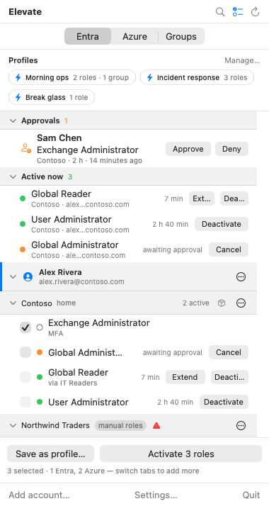
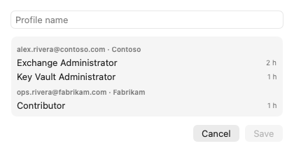
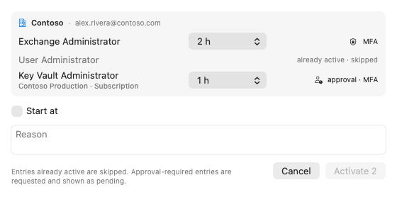
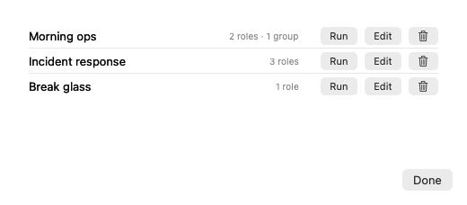

# Profiles and shortcuts

A profile is a saved set of roles that you activate together with one click: the roles for
your morning routine, for an incident, for a release day. This guide shows how to create, run,
edit and trigger them.

> The pictures in this guide are real renders of the app with sample data from a fictional
> organization.

## Save a profile

1. Click the **select roles** button in the panel header.
2. Tick the roles you want, on any tab and in any tenant. The footer counts what you have
   selected.
3. Click **Save as profile…**.

Name the profile. The sheet lists what running it will ask for today: the duration Elevate
remembers for each role, or the policy default, and which roles need approval.

Click **Save**. The reason you type on a run is remembered per role, so later runs are pre-filled
with it.

## Run a profile

Profiles appear as chips under the tabs. Click one to open the run sheet:

- Each entry shows its duration, which you can change for this run.
- Entries that are **already active** or **pending** are skipped, and the sheet says so. An entry
  you are no longer eligible for shows **not eligible · skipped**.
- Roles that need approval are requested and shown as pending afterwards.
- **Start at** schedules the whole run for later.
- Enter a reason and click **Activate N**. Progress shows per row, and a notification reports the
  outcome when the sheet is closed.

**Option-click** a chip to run it without the sheet, using the remembered reason and durations.
If anything needs input, such as a missing reason or an MFA step, the sheet opens instead.

## Manage profiles

Click **Manage…** on the Profiles row.

- **Run** opens the run sheet.
- **Edit** loads the profile's roles into the panel's selection. Open the panel, adjust the ticks
  across the tabs, then click **Update "<name>"** in the footer.
- The trash button deletes a profile after confirmation. Active roles are not touched.
- Drag profiles to reorder the chips.

## A global keyboard shortcut

One profile can be bound to a system-wide shortcut, so you can run it without opening the
panel. In **Settings…** under **Global shortcut**:

1. Click **Record shortcut** and press a combination that includes ⌘, ⌃ or ⌥.
2. Choose the profile under **Runs profile**.

The shortcut behaves like Option-clicking the chip: it runs silently when it can and opens the
run sheet when it needs input. If macOS refuses the combination, Elevate says so under the field;
pick another.

## Tips

- Keep profiles small and specific. A profile that includes a role needing approval will always
  leave that role pending; put such roles in their own profile so the rest activate instantly.
- Profiles remember roles by tenant and account. If you sign an account out and back in, its
  profiles keep working; if you remove a tenant, its entries are dropped from every profile.
- Selections can span tenants, and the footer reminds you that switching tabs adds more roles to
  the same selection.
