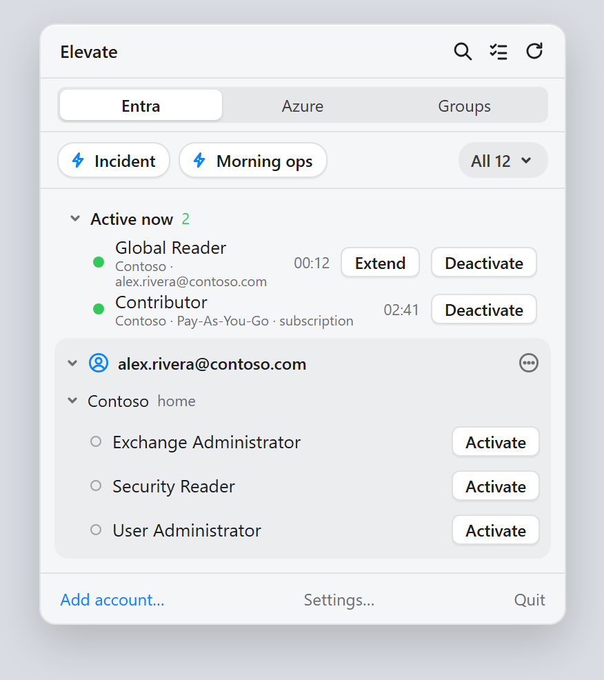
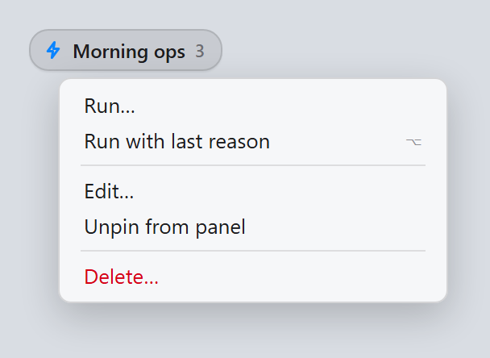
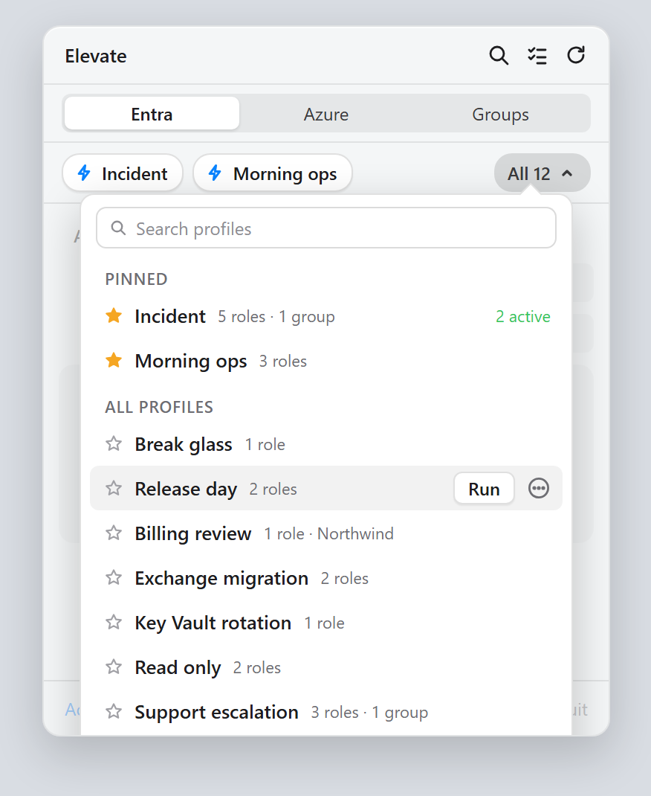
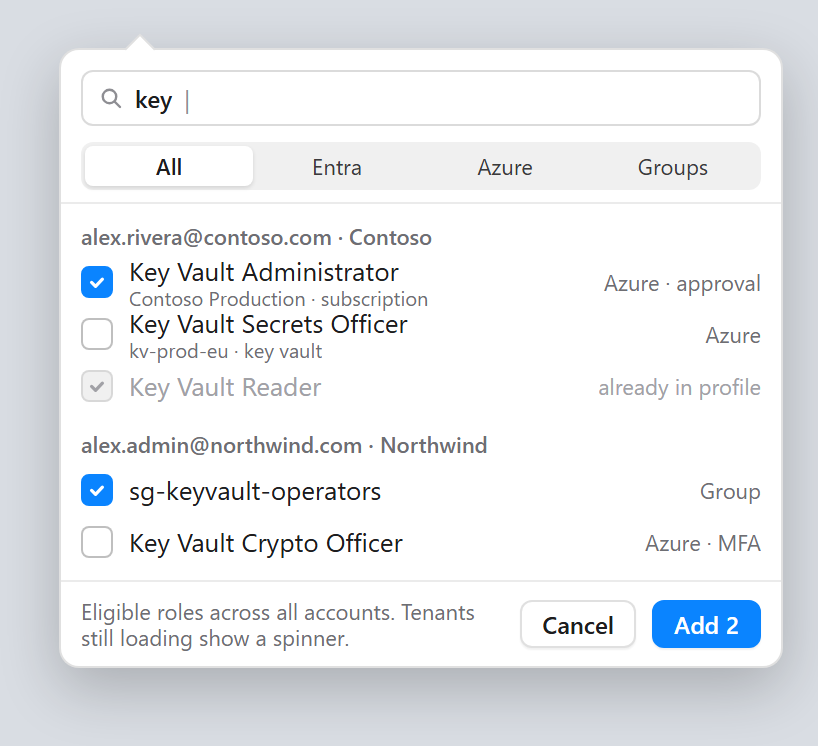
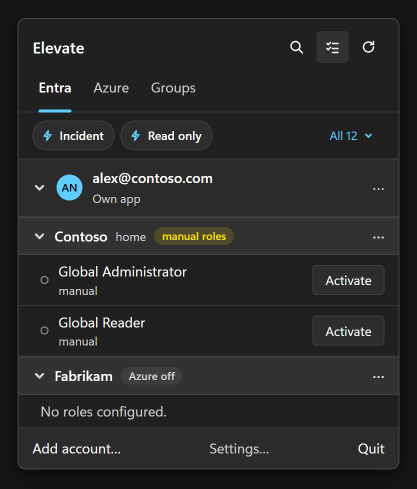
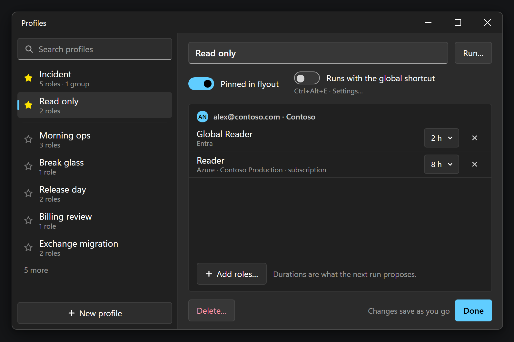

# Profiles and shortcuts

A profile is a saved set of roles that you activate together with one click: the roles for
your morning routine, for an incident, for a release day. This guide shows how to create, pin,
run, edit and trigger them.

> The pictures of the profiles row, the All list and the Profiles window are design mockups with
> sample data from a fictional organization; the run and save sheets are real renders. The
> Windows app matches feature for feature, with **Ctrl-click** where macOS uses Option-click.

## Save a profile

1. Click the **select roles** button in the panel header.
2. Tick the roles you want, on any tab and in any tenant. The footer counts what you have
   selected.
3. Click **Save as profile…**.

Name the profile. The sheet lists what running it will ask for today: the duration Elevate
remembers for each role, or the policy default, and which roles need approval.

Click **Save**. The reason you type on a run is remembered per role, so later runs are pre-filled
with it. You can also start from an empty profile in the Profiles window and add roles there.

## Pin the profiles you use most

Under the tabs sits one row: a chip for each **pinned** profile, and **All N** for the rest.

- Pin up to four profiles. The row never wraps, so the panel keeps its height however many
  profiles you save; with more than four you would be reading a list anyway, and that is what
  **All N** is for.
- Pin from the All list, from a chip's menu, or from the Profiles window. When four are already
  pinned, the star refuses and says so; unpin one first.
- With profiles but nothing pinned, the row says so and offers **All N**. With no profiles at
  all, the row is hidden.

## Run a profile

Click a chip to open the run sheet:

- Each entry shows its duration, which you can change for this run.
- Each entry has a checkbox, ticked by default. Untick a role to leave it out of this run only;
  the profile itself is unchanged and the role is ticked again next time.
- Entries that are **already active** or **pending** are skipped, and the sheet says so. An entry
  you are no longer eligible for shows **not eligible · skipped**.
- Roles that need approval are requested and shown as pending afterwards.
- **Start at** schedules the whole run for later.
- Enter a reason and click **Activate N**. Progress shows per row, and a notification reports the
  outcome when the sheet is closed.

**Option-click** a chip to run it without the sheet, using the remembered reason and durations.
If anything needs input, such as a missing reason or an MFA step, the sheet opens instead.

Right-click a chip for the rest:

## Find any profile

**All N** opens the full list, pinned profiles first.

- Type to filter. **Return** runs the first match; **Option-Return** runs it silently.
- The star on each row pins or unpins it without leaving the list.
- Hover a row for **Run** and the **⋯** menu, the same menu as on a chip. A row whose roles are
  already active says so.
- **Manage profiles…** at the bottom opens the Profiles window.

## Edit a profile

Choose **Manage profiles…** from the All list, or **Edit…** from a chip's menu to open the window
on that profile.

The list on the left holds every profile; the one you select is edited on the right, and every
change is saved as you make it. **Done** only closes the window.

- Rename in the name field. **Pinned in panel** puts the profile in the row; the shortcut switch
  makes it the profile the global shortcut runs.
- The roles are grouped by account and tenant. Each shows the duration the next run will propose,
  which you can change here, and the **−** button removes it.
- **Add roles…** opens a picker over every account and tenant, with search and an
  All / Entra / Azure / Groups filter. Roles already in the profile are listed but greyed, so a
  search that finds nothing new tells you why. Tenants still loading are marked.

  

- **Run…** opens the run sheet. **Delete…** asks first; active roles are never touched.
- **+** under the list starts an empty profile. Drag rows to reorder the chips.

## On Windows

The flyout and the Profiles window follow the same design with Fluent controls: **Ctrl-click** a
chip to run it silently, **Enter** in the All list runs the first match, and **Add roles…** opens
a dialog.

## A global keyboard shortcut

One profile can be bound to a system-wide shortcut, so you can run it without opening the
panel. In **Settings…** under **Global shortcut**:

1. Click **Record shortcut** and press a combination that includes ⌘, ⌃ or ⌥ (Ctrl, Alt or Win on
   Windows).
2. Choose the profile under **Runs profile**, or flip **Runs with the global shortcut** in the
   Profiles window.

The shortcut behaves like Option-clicking the chip: it runs silently when it can and opens the
run sheet when it needs input. If the system refuses the combination, Elevate says so under the
field; pick another.

## Tips

- Keep profiles small and specific. A profile that includes a role needing approval will always
  leave that role pending; put such roles in their own profile so the rest activate instantly.
- Pin the two or three profiles you run daily and leave the rest to the All list; Return in that
  list is one keystroke away from the chip.
- Profiles remember roles by tenant and account. If you sign an account out and back in, its
  profiles keep working; if you remove a tenant, its entries are dropped from every profile.
- Selections can span tenants, and the footer reminds you that switching tabs adds more roles to
  the same selection.
