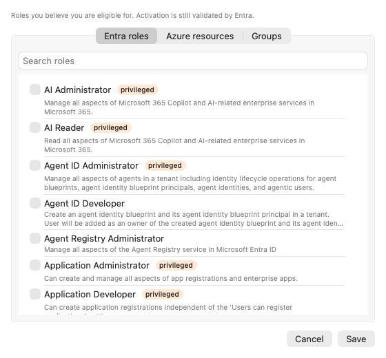

# Troubleshooting

What the panel's warnings mean and how to get past them.

> The pictures in this guide are real renders of the app with sample data from a fictional
> organization.

## A tenant shows "manual roles"

Elevate could not read your eligible roles in that tenant, usually because an administrator has
not yet consented to the Elevate app registration there. Two ways forward:

- **Get consent.** Open the tenant menu (the circled dots on the tenant row) and choose **Open
  admin consent link…**. Send the link to a tenant administrator, or open it yourself if you are
  one. After consent, choose **Retry discovery** from the same menu. If you are using the shared
  Elevate app, Settings › Entra app registration also has a **Grant admin consent…** button; that
  link uses the `organizations` segment rather than a tenant id, so an administrator can grant
  consent before any account exists. The administrator sees Microsoft's "This app may be risky"
  warning first, because the shared registration has no verified publisher — see
  [The shared Elevate app](shared-app-registration.md).
- **Configure the roles you know you hold.** Choose **Configure known PIM roles…** in the tenant
  menu:

Tick Entra roles from the catalogue, add Azure scopes with a role name, or add group IDs. Elevate
lists them with a **manual** caption and tries to activate them when you ask; Entra still
validates every request, so a role you do not actually hold fails with a clear message.

## An account is marked "Azure roles only"

The account was added with the Azure CLI or Azure PowerShell app. Microsoft grants those apps no
Graph PIM permissions, so Elevate never reads or activates Entra roles or group memberships for
it and never shows permission errors for them either. Azure resource roles work normally.

To get Entra roles for that account, upgrade it to an Entra app registration from its account
menu on macOS (**Upgrade to Entra app registration…**), which keeps its tenants and roles — or
sign it out and add it again with **Entra app registration** or **Other app (browser sign-in)**.

## Azure is off in a tenant

A quiet **Azure off** caption in a tenant header means the first Azure read in that tenant was
refused, most often because the account has no Azure access there at all. Elevate stops asking so
the tenant stays clean. If you gain Azure access later, choose **Retry discovery** from the tenant
menu.

## "needs to sign in again"

An orange banner names an account whose saved sign-in is gone: the refresh token expired, was
revoked, or the keychain item was removed. Click the **Sign in** button on the account row, or
choose **Sign in again** from its menu. Roles and profiles are kept while the account waits.

## A refresh or discovery failed

A red triangle on a tenant header means the last refresh hit an error. Hover for the message,
or click for the full list. Typical causes:

- No network. The header shows **offline** and Elevate resumes on its own.
- A step-up sign-in was dismissed. Press the refresh button and complete it.
- A tenant's Conditional Access blocks the sign-in method. Try another method, or use your own
  registration.

## Activation refused

A red message on the row states Entra's reason. The usual ones:

- **Not eligible**: the eligibility ended or was never there; refresh, or remove the role from
  known roles.
- **Policy violation**: a ticket number is required, the duration exceeds the maximum, or the
  role must stay active for five minutes before it can be deactivated.
- **Multi-factor authentication required**: complete the browser step-up and try again.

## Activated, but nothing happened

PIM reports an assignment active as soon as it writes it. The access behind it arrives later —
usually two to five minutes for an Entra directory role, up to fifteen for an Azure resource role,
and a group membership reaches a token only when that token is next issued. The portal tab you had
open, and every tool already signed in, keeps the token it was given before the activation.

Elevate does not take PIM's word for it. After an activation settles it probes the thing that would
actually enforce the role:

- **Entra directory roles**: a token minted right then, looking for the role in its `wids` claim —
  which is what Graph and every other Entra-protected service reads. A role scoped to an
  administrative unit or an application is not carried in a token at all, so those report that
  Elevate cannot tell.
- **Azure resource roles**: Azure's own permission check at the activated scope, compared against
  what the role definition grants.
- **PIM for Groups**: a fresh token's `groups` claim when the registration emits one, otherwise
  Graph's transitive membership check. Group *ownership* is not a claim, so it reports that
  Elevate cannot tell.

In the panel, a role in that state keeps its countdown — the clock started when PIM recorded the
activation, whatever the access is doing — but its dot is drawn hollow and the row reads
**propagating (~3 min)**. The dot fills and a notification arrives when the access is in effect, so
you can switch away and be told the right moment. A role that never confirms reads **not in effect
yet**, and hovering it names the likely cause. It stays deactivatable throughout: it is active
either way.

`elevate activate --wait`, `elevate profiles run --wait` and `elevate run` all wait for this rather
than for PIM's record, and say which of three things happened:

| What you see | What it means |
| --- | --- |
| `in effect` | A probe saw the access. The role works now. |
| `active, but still not in effect` | The probe kept saying no until the deadline. The role is active regardless; the message names the likely cause, which is almost always a stale token somewhere else. |
| `active; Elevate cannot confirm it is in effect` | There is nothing to observe from here — a directory-scoped role, group ownership, or a sign-in method whose token Elevate cannot read. Not a failure. |

`--settle 2m` bounds the check for `elevate run`; `--settle 0` turns it off and restores the old
fixed pause for groups. If a role keeps coming back "still not in effect", the next section is the
usual reason.

## Activated, but the Azure CLI or kubectl still says AuthorizationFailed

The Azure CLI, Azure PowerShell and kubelogin cache the token they got before the activation. That
token does not carry the new Azure role assignment or group membership, and the tools keep using it
until it expires, so a command right after activating is refused as if nothing had happened.
Elevate shows a hint after an Azure or group activation, in the panel and in the CLI, with the fix.
The hint appears only for accounts signed in with the Azure CLI or Azure PowerShell app, where
Elevate shares the tool's own token cache and the stale token is certain; an account signed in
through an app registration has its own cache, so Elevate cannot tell whether you use those tools
as that account and stays quiet. If you do, the same commands apply:

- Azure CLI: `az login` again (`az account get-access-token` has no flag that forces a fresh
  token; it hands back the cached one). `az account clear` first if the sign-in reuses the cache.
- AKS with kubelogin: `kubelogin remove-tokens`, then run the `kubectl` command again.
- Azure PowerShell: `Connect-AzAccount` again.

A group membership also takes a few minutes to reach new tokens. `elevate run` and `--wait` do not
take PIM's word for it: once the assignment is active they probe until the access is genuinely in
effect — a token minted now carrying the directory role or the group, or Azure agreeing at the
activated scope — and only then run the command. `--settle 2m` bounds that check; `--settle 0`
turns it off and restores the old fixed pause for groups. See
[Activated, but nothing happened](#activated-but-nothing-happened) for what the states mean. The
hint can be hidden per account: close it in the panel, or `elevate config set token-hint off
--account <name>` in the CLI (`on` brings it back).

## A field says "Managed by your organization"

Your organization pushed that setting through Intune, Jamf or Group Policy, so it is locked: the
field is greyed out, shows the value your administrator chose, and Elevate refuses changes to it.
The bottom of Settings has a **Managed by your organization** section listing everything that is
managed, and **Copy diagnostics** includes the same key names.

You may see the same thing elsewhere:

- **Updates are managed by your organization** — the daily update check is off; your fleet gets new
  versions from your management system.
- A sign-in method missing from **Add account…**, or an account captioned **Sign-in method no
  longer permitted by your organization** — only some methods are permitted. That account keeps
  working; sign it out and add it again with a permitted method to sign in afresh.
- A tenant greyed out with **Not permitted by your organization** in Discover tenants, or a tenant
  whose menu says **Pinned by your organization** instead of offering Remove — your administrator
  chose which tenants you track.
- A profile marked **Published by your organization** — you can run it and bind it to the shortcut,
  but not rename, edit, pin or delete it. It does not use up any of your four profile pins, and a
  role you are not eligible for shows as "not eligible · skipped" instead of failing the run.

Nothing here is a bug, and there is no way around it from the app — ask whoever manages your
machines. If you are that person: [docs/enterprise/README.md](enterprise/README.md).

## Notifications are silent

Allow notifications for Elevate under System Settings → Notifications. Elevate shows a notice in
the panel when permission was denied.

## Launch at login does not stick

macOS may require approval the first time. The Settings toggle explains this under the switch;
approve Elevate under System Settings → General → Login Items.

## Reporting a bug

Open **Settings…** and click **Copy diagnostics**. The clipboard now holds the app version and
signing state, your accounts and tenants with their modes and limits, profile names, and the last
errors with timestamps. It never contains tokens, client secrets or role justifications; the
client id appears only as `Client id: shared Elevate app`, `own registration` or `not set`.
Paste it into a GitHub issue at https://github.com/FrodeHus/elevate/issues.
